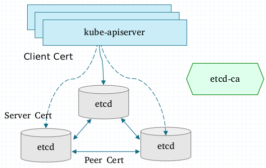
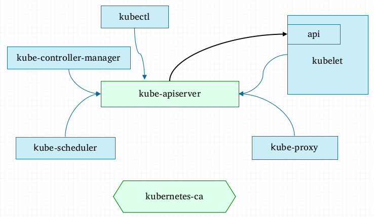

# 手动部署Kubernetes集群
手动部署Kubernetes集群。操作系统为CentOS 7.6.1810 X86_64，用到的各相关程序版本如下：

- etcd: 3.3
- kubernetes: v1.13.4

##### 系统环境说明：

| 主机地址    | 节点名称                             | 角色             |
| :---------- | ------------------------------------ | ---------------- |
| 172.29.3.6  | k8s-master01.ilinux.io, k8s-master01 | k8s-master, etcd |
| 172.29.3.7  | k8s-master02.ilinux.io, k8s-master02 | k8s-master, etcd |
| 172.29.3.8  | k8s-master03.ilinux.io, k8s-master03 | k8s-master, etcd |
| 172.29.3.11 | k8s-node01.ilinux.io, k8s-node01     | k8s-node         |
| 172.29.3.12 | k8s-node02.ilinux.io, k8s-node02     | k8s-node         |

注意：本文 假设高可用后的API Server使用“\<clustername>-api.\<domain-name>”的格式，例如对于使用的ilinux.io域名来说，若集群名称为mykube，则客户端应该使用“mykube-api.ilinux.io”作为API Server的主机名称。因此，请确保各节点能够解析此FQDN至合适的结果，例如上面的三个master节点的IP地址，或者API Server前面的代理服务器的地址。

## etcd集群
### 安装etcd

etcd集群通常按应用规模大小应该有3、5或7个节点，以提供高可用服务，本示例将使用k8s-master01、k8s-master02和k8s-master03三个节点。因此，请于此三个节点上分别运行如下命令：
~]# yum install etcd

提示：etcd程序包位置extras仓库中。

### 生成数字证书

#### 脚本生成etcd的相关证书

生成数字证书的操作过程仅需要在一个节点上执行即可，例如k8s-master01。

~]$ git clone https://github.com/iKubernetes/k8s-certs-generator.git

~]$ cd k8s-certs-generator

k8s-certs-generator]$ bash gencerts.sh etcd

脚本完成后会于当前目录下生成一个名为etcd的子目录，其结构如下所示，其中的pki子目录是为etcd准备的各相关证书和私钥文件的目录，各文件名基本可以做到见名知义。

k8s-certs-generator]$ tree etcd
etcd
├── patches
│   └── etcd-client-cert.patch
└── pki
    ├── apiserver-etcd-client.crt
    ├── apiserver-etcd-client.key
    ├── ca.crt
    ├── ca.key
    ├── client.crt
    ├── client.key
    ├── peer.crt
    ├── peer.key
    ├── server.crt
    └── server.key

接下来需要将pki子目录分别复制到etcd三个节点上的etcd的配置文件目录/etc/etcd中。

k8s-certs-generator]$ scp -rp etc/pki root@k8s-master01:/etc/etcd/

k8s-certs-generator]$ scp -rp etc/pki root@k8s-master02:/etc/etcd/

k8s-certs-generator]$ scp -rp etc/pki root@k8s-master03:/etc/etcd/

### 配置etcd
etcd的主配置为/etc/etcd/etcd.conf，各节点上使用的个别配置参数的取值会有不同，主要是需要分别根据节点自身的环境进行取值。需要配置的各参数说明如下：

* ETCD_DATA_DIR="/var/lib/etcd/k8s.etcd"：集群数据目录，可保持默认或按需取值；建议各节点保持一致；
* ETCD_LISTEN_PEER_URLS：当前节点用于集群内的节点间通信监听的URL，需要以IP地址格式给出当前节点用于etcd集群通信的接口的IP地址，例如"https://172.29.3.6:2380"；
* ETCD_LISTEN_CLIENT_URLS：当前节点向客户端提供服务所监听的URL，需要以IP地址格式给出当前节点用于向客户端提供服务的接口的IP地址，例如"https://172.29.3.6:2379"；
* ETCD_NAME：当前节点的主机名称，例如"k8s-master01.ilinux.io"；
* ETCD_INITIAL_ADVERTISE_PEER_URLS：此成员节点向etcd集群通告的URL，例如"https://k8s-master01.ilinux.io:2380"；
* ETCD_ADVERTISE_CLIENT_URLS：此节点通告的用于向客户端提供服务的URL，例如"https://k8s-master01.ilinux.io:2379"；
* ETCD_INITIAL_CLUSTER="k8s-master01.ilinux.io：用于引导并启动集群的配置信息，由集群的全部成员节点向集群通告的URL组成的列表，例如"k8s-master01.ilinux.io=https://k8s-master01.ilinux.io:2380,k8s-master02.ilinux.io=https://k8s-master02.ilinux.io:2380,k8s-master03.ilinux.io=https://k8s-master03.ilinux.io:2380"；
* ETCD_CERT_FILE：用于同客户端通信时使用的服务器证书文件路径，例如"/etc/etcd/pki/server.crt"
* ETCD_KEY_FILE：用于同客户端通信时使用的服务器证书匹配的私钥文件，例如"/etc/etcd/pki/server.key"
* ETCD_CLIENT_CERT_AUTH：是否需要认证客户端，安全通信的场景需要启用，其值需要为"true"
* ETCD_TRUSTED_CA_FILE：指定信任的CA的数字证书，例如"/etc/etcd/pki/ca.crt"
* ETCD_PEER_CERT_FILE：etcd集群成员间通信时用于认证的peer格式的数字证书，例如"/etc/etcd/pki/peer.crt"
* ETCD_PEER_KEY_FILE：etcd集群成员通信时所用证书所配对的私钥，例如"/etc/etcd/pki/peer.key"
* ETCD_PEER_CLIENT_CERT_AUTH：是否验正集群成员节点的客户端证书，安全通信的场景需要启用，其值为"true"
* ETCD_PEER_TRUSTED_CA_FILE：用于为成员安全通信签署证书的CA的证书，例如"/etc/etcd/pki/ca.crt"

### 启动服务

各节点上分别启动etcd服务：

~]# systemctl start etcd.service

如有必要，可设置其开机自动启动：

~]# systemctl enable etcd.service

测试访问：

## 配置第一个Master主机

配置高可用的master集群时，有些步骤仅需要在配置第一个master主机时运行一次即可，因此，这里分开进行说明。本示例以k8s-master01为配置的第一个master主机。

### 安装kubernetes-server程序包

首先下载程序包，这里以v1.13.4为例，读者朋友们可以根据需要进行调整：

~]# wget https://dl.k8s.io/v1.13.4/kubernetes-server-linux-amd64.tar.gz

将程序包展开至/usr/local/目录中：

~]#  tar xf  kubernetes-server-linux-amd64.tar.gz  -C  /usr/local/

### 提供配置文件 

首先克隆配置文件模板仓库：

~]# git clone https://github.com/iKubernetes/k8s-bin-inst.git

接着复制master用到的配置文件：

~]# cp k8s-bin-inst/master/etc/kubernetes  /etc/

注意：复制完成后，需要修改/etc/kubernetes/apiserver文件中使用的etcd URL为匹配实际使用的etcd各节点的相关信息，另外还要确保/etc/kubernetes/apiserver、/etc/kubernetes/controller-manager和/etc/kubernetes/schedler文件中引用的证书、私钥等文件路径与实际的路径相匹配。

再复制master的各组件的unit file，以便使用systemd管控各守护进程。

~]# cp k8s-bin-inst/master/unit-files/*  /usr/lib/systemd/system/

### 生成kubernetes用到的证书及kubeconfig文件

于k8s-master01节点上切换至此前克隆生成的 k8s-certs-generator目录，为各master和node节点分别生成相关的数字证书、私钥和kubeconfig文件等。

~]# cd k8s-certs-generator

k8s-certs-generator]# bash gencerts.sh k8s

注意：请按脚本提示输入正确的域名、各master节点的主机名（不带域名后缀）及要使用的kubernetes集群的名称。这些信息将组合成主机名称等用于数字证书和kubeconfig文件，以及各node访问API Server时使用的主机名，以mykube集群名称和ilinux域名为例，各node及客户端应该使用mykube-api.ilinux.io访问API Server。

此脚本会于当前目录中生成一个名为kubernetes的子目录，它的目录结构如下，其中auth目录中保存有用到的各kubeconfig文件，pki目录中则主要是证书及私钥文件。各master节点分别拥有自己专用的目录，而各node则可共用kubelet子目录下的内容。

k8s-certs-generator]# tree -d kubernetes/
kubernetes/
├── CA
├── k8s-master01
│   ├── auth
│   └── pki
├── k8s-master02
│   ├── auth
│   └── pki
├── k8s-master03
│   ├── auth
│   └── pki
└── kubelet
    ├── auth
    └── pki

于是，为第一个master节点k8s-master01提供用到的证书、私钥及kubeconfig等文件时，将脚本生成的kubernetes/k8s-master01子目录下的所有内容复制到k8s-master01主机上的/etc/kubernetes目录中即可。

~]# cp -rp kubernetes/k8s-master01/*  /etc/kubernetes/

### 启动服务

API Server等各守护进程应该以普通用户的身份运行，例如kube用户。于是下面首先创建运行者用户及相关的工作目录：

~]# useradd -r kube
~]# mkdir /var/run/kubernetes
~]# chown kube.kube /var/run/kubernetes

启用master的各相关程序：

~]# systemctl start kube-apiserver kube-controller-manager kube-scheduler

若有必要， 可设置为开机自动运行：

~]# systemctl enable kube-apiserver kube-controller-manager kube-scheduler

### 配置kubectl

~]# mkdir $HOME/.kube
~]# cp /etc/kubernetes/auth/admin.conf $HOME/.kube/config

### 激活bootstrapper

创建ClusterRoleBinding，授予用户相应操作所需要的权限：

~]# kubectl create clusterrolebinding system:bootstrapper --group=system:bootstrappers --clusterrole=system:bootstrapper
或者：
~]# kubectl create clusterrolebinding system:bootstrapper --user=system:bootstrapper --clusterrole=system:node-bootstrapper

### 部署网络插件flannel

~]# kubectl apply -f https://raw.githubusercontent.com/coreos/flannel/master/Documentation/kube-flannel.yml

### 部署CoreDNS

~]# git clone https://github.com/coredns/deployment.git

~]# cd deployment/kubernetes/

~]# ./deploy.sh  -i 10.96.0.10  -r  "10.96.0.10/12"  -s  -t  coredns.yaml.sed | kubectl apply -f  -

## 配置其它Master节点

其它master节点的配置过程与第一个master节点相同，除了以下步骤：

- 不能再次生成证书，而是要由此前生成的证书目录中分别复制（例如使用scp命令直接从k8s-master01节点上的k8s-certs-generator目录中进行复制）
- 不需要额外执行激活bootstrapper的步骤
- 不需要执行flannel和coredns的部署操作

## Node

各node主机的配置过程相同，下面以k8s-node01为例给出相关的步骤。

### 部署Docker容器引擎

先获取docker-ce的配置仓库配置文件：

~]# wget https://mirrors.aliyun.com/docker-ce/linux/centos/docker-ce.repo -O /etc/yum.repos.d/

安装Docker：

~]# yum install docker-ce

启动Docker服务：

~]# systemctl start docker.service

~]#  systemctl enable docker.service 

提示：请确保docker能合理获取到需要pause镜像，它默认位于k8s.gcr.io仓库中。

### 部署CNI插件

获取相关的程序包，并展开至指定的目录，以当前的0.7.4版本为例：

~]# wget https://github.com/containernetworking/plugins/releases/download/v0.7.4/cni-plugins-amd64-v0.7.4.tgz

~]# mkdir -p /opt/cni/bin 

~]# tar xf cni-plugins-amd64-v0.7.4.tgz -C /opt/cni/bin/

### 部署kubernetes node

#### 安装node程序包

首先下载程序包，这里以v1.13.4为例，读者朋友们可以根据需要进行调整，但要与master端的版本一致：

~]# wget https://dl.k8s.io/v1.13.4/kubernetes-node-linux-amd64.tar.gz

将程序包展开至/usr/local/目录中：

~]#  tar xf  kubernetes-node-linux-amd64.tar.gz  -C  /usr/local/

#### 提供配置文件

配置文件模板位于github.com/ikubenretes/k8s_bin_inst仓库中，此仓库此前曾克隆至k8s-master01节点上，因此可直接从k8s-master01节点上进行复制。

root@k8s-master01 ~]# scp -rp k8s-bin-inst/nodes/etc/kubernetes/  k8s-node01:/etc/

root@k8s-master01 ~]# scp -rp k8s-bin-inst/nodes/var/lib/*  k8s-node01:/var/lib/

提示：必要时，可按需修改复制的各配置文件。

#### 提供Unit File

unit file也模板位于github.com/ikubenretes/k8s_bin_inst仓库中，此仓库此前曾克隆至k8s-master01节点上，因此同样可直接从k8s-master01节点上进行复制。

root@k8s-master01 ~]# scp  k8s-bin-inst/nodes/unit-files/*   k8s-node01:/usr/lib/systemd/system/

#### 提供证书及kubeconfig文件

node主机使用的证书文件需要与此前为master相匹配，相关证书于前面部署第一台master节点时已经生成，它位于k8s-node01节点上，将其复制到k8s-node01即可。

root@k8s-master01 ~]# scp -rp k8s-certs-generator/kubernetes/kubelet/*  k8s-node01:/etc/

### 启用ipvs内核模块

创建内核模块载入相关的脚本文件/etc/sysconfig/modules/ipvs.modules，设定自动载入的内核模块。文件内容如下：

    #!/bin/bash
    ipvs_mods_dir="/usr/lib/modules/$(uname -r)/kernel/net/netfilter/ipvs"
    for i in $(ls $ipvs_mods_dir | grep -o "^[^.]*"); do
        /sbin/modinfo -F filename $i  &> /dev/null
        if [ $? -eq 0 ]; then
            /sbin/modprobe $i
        fi
    done

### 启动服务

~]# systemctl daemon-reload

~]# systemctl start kubelet kube-proxy

## 签署node的数字证书

每次新增node节点，待kubelet首次启动时，它会向API Server提交证书签署请求，此请求默认需要由管理员手动确认签署。下面的命令需要在允许执行kubectl命令且拥有管理权限的节点上进行，例如k8s-master01。

~]# kubectl get csr

~]# kubectl certificate approve CSR_NAME

